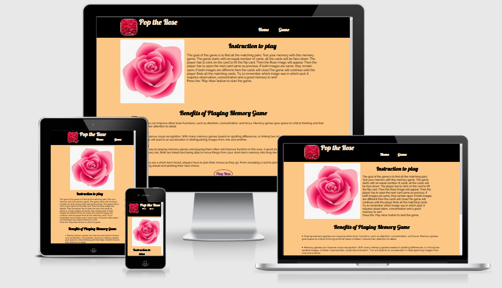
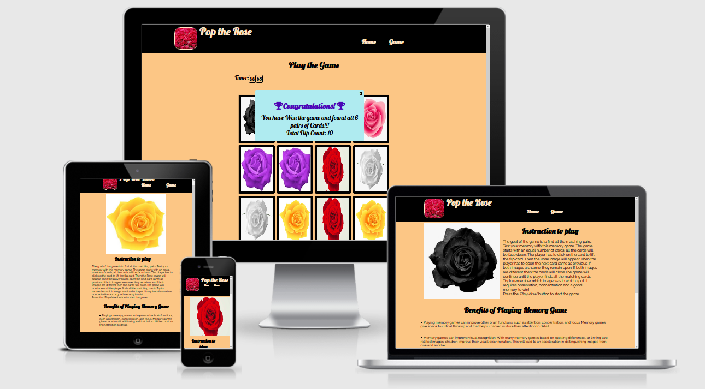
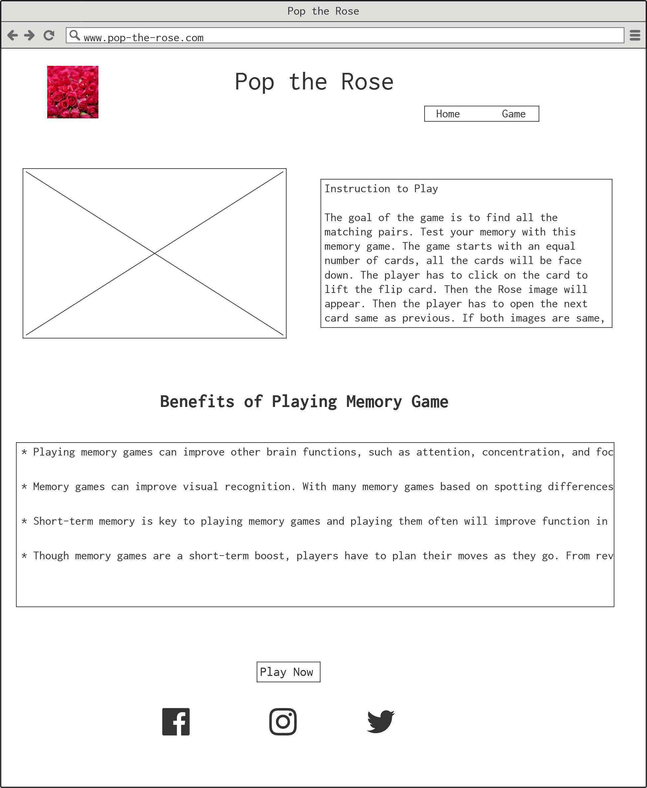
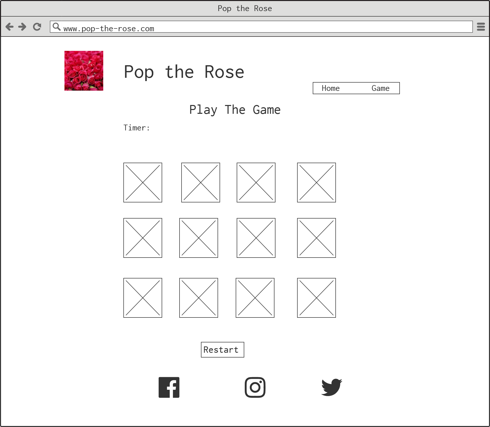
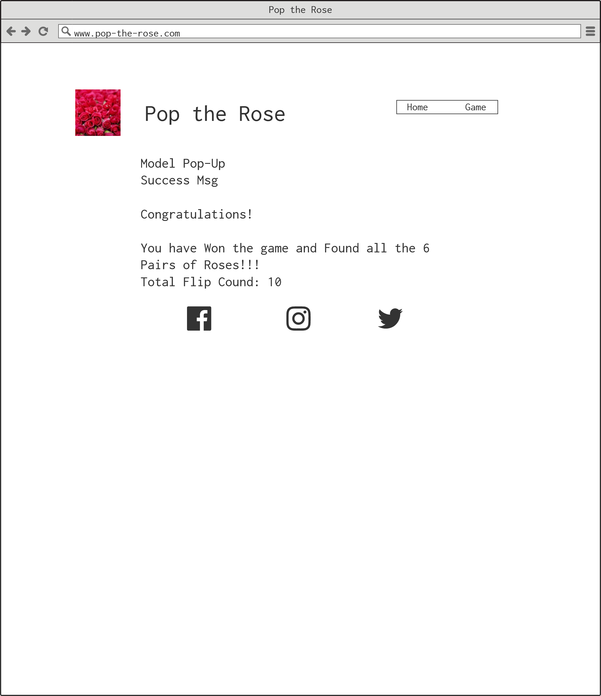
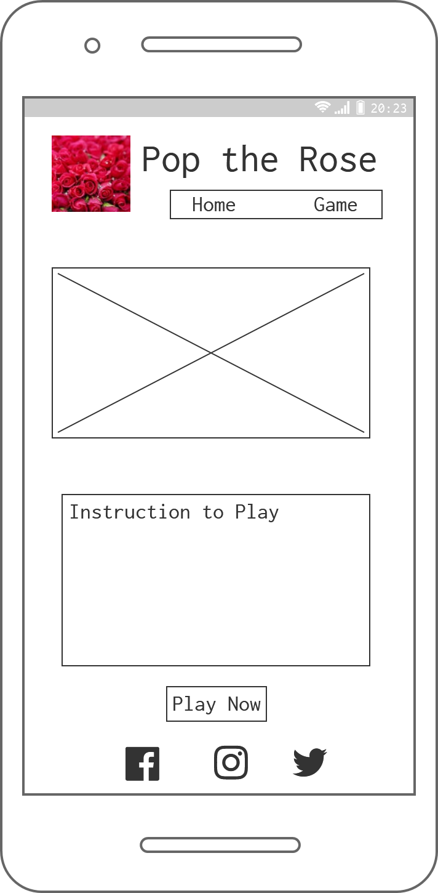
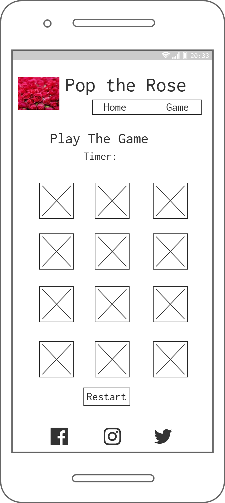
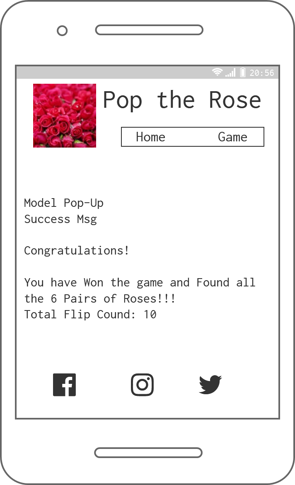

# pop the Rose
   

      

## Types of Content
- [Introduction](#introduction)
  - [Home](#home)
  - [Game](#game)
- [Strategy](#strategy)
  - [UX](#ux)
  - [Business Vision](#business-vision)
  - [Purpose of Website](#purpose-of-website)
- [Scope](#scope)
  - [Features](#features)
  - [Future Feature](#future-feature)
- [Structure](#structure "Goto Structure")
   - [Wireframes](#wireframes)
   - [Colours](#colours "Goto Colours Section")
   - [Typography](#typography)
- [Technologies Used](#technologies-used)
- [Testing](#testing)
- [Bugs](#bugs)
- [Deployment](#deployment)
- [Acknowledgement](#acknowledgement)

 ## Introduction
   This project is designed to test the brain memory. This game is useful for kids and adults to test their memory power. 
   I have used colourful Rose Pictures to create the pleasant feeling while playing this memory game. 
   The Webpage is categorised into two main sections, such as Home and Game. 
   Congratulation Message will pop up end of each game with stating time taken vs total number of flipped cards lifted. This function encourage the players to grade their memory power each time they play this memory game.

   ### Home
   The Home page covers the following section:
   - Header and Navigation Menu
   - Images of Roses
   - Instruction to Play
   - Benefits of Playing Memory Card
   - Play Now Button
   - Footer

   ### Game
   The Game Page covers the following section:
  - Header and Navigation Menu
  - Play the game with flipped rose images
  - Start Again Button
  - Once find all the roses the pop up message with Congratulations message, Timer and Total Moves.
  - Footer

## Strategy
  The website covers all the screen types, such as Pc, Laptop, Tablet and Mobile. The website is easily navigate to all the sections.

  ### UX
  - As a user i would like to know how to play this game.
  - As a user i would like to know the benefits of playing this game.
  - As a user i would expect pictures used in the game to be suitable for all age groups.
  - As a user i would expect encourage messages.
  - As a user i would like to know how long did i take to complete the game.
  - As a user i would like to know how many flip cards are lifted for each game.

  ### Business Vision
  This game is designed for all age group.The Rose picture is choosen to create the pleasant feeling while playing the game.The time function is included in this game to attract people to play this game repeatedly to improve their brain memory.

  ### Purpose of Website
  Inspiration of this project comes from current covid situation where people needs a break between their normal stressful work schedule.This game relaxes people's mind and sharpen their memory power.
  

## Scope
The website covers instruction how to play. Timer function and total flip card functions are used to test how they played this game each time.
### Features
Header and Footer are commenly used in all pages.
  #### Header
  Header is consists of Name and Logo and located on the left side of the page. There are two menu options are available on the right side. The two menu options used are Home and Game.
  #### Footer:
  Footer is consists of Social Networks icons such as Facebook, Twitter and Instagram.
  #### Home Page
  Home page contains pictures of Roses used in the game,Instruction of the game and Benefits of playing the memory game.

  #### Game page
  The Next page is called Game Page, where the game is actually played. In the Game page, Restart button option is available to replay the game.
  ### Pop-up Message
  The last part of the game is pop-up message. The game completes with Congratulation popup message. it also provides time used to play the game,and number of flip cards lifted while playing the game.
  ### Future Features
  - Integrate more games into this website, provideing more option to the player.
  - Adding music into each type of game.

  ## Structure
  This project is divided into two main pages. The website was better organised after my mentoring session with my mentor. The website was structured such a way that the users can navigate to find relevant information according to their need.

  ### Wireframes
  Balsamiq Wireframes used for this website.
  

Home-Page

Game-Page

Model Popup

Home-Page-Mobile

Game-Page-Mobile

Model-Popup-Mobile

  

  ### Colours
  I have used warm light and dark colours to create pleasant experience for those people to viewing this website.
  colors used:
  - #fcc685
  - #000000
  - #b60e2a
  - #ffffff
  - #afebf0
  - #4a06b7

  ### Typography
  I have used 'Lobster', cursive and 'Raleway', sans-serif to create this website.

  ## Technologies Used

   - HTML-used for to create the website.
   - CSS- used for style the website.
   - Java Script - JavaScript allows users to interact with web pages.
   - GitHub- to save the project code and host the live  project.
   - GitPod- is an open source platform for automated and ready-to-code.
   - Google Fonts-used for the website looks more beautiful,fast and great typography
   -  Font Awesome - icons used throughout the site.
    Responsive design - To generate the mockup image.
## Testing
  ### Code Validation
 - W3 Markup Validation Service- To validate HTML document, i used Validate by direct input, some errors shown, and then i fixed the errors.
W3 HTML Validation Result: 
Document checking completed. No errors or warnings to show.
- W3 CSS Validation Service- To validate HTML document, i used validate by direct input, no errors shown in the W3 validation page.
W3 CSS validation Result:
Congratulations! No Error Found.
- Jshint JavaScript Validation - 

  ### Supported Screen and Browsers
  I have used the most common browser to test my website, 
   1. Mozilla Firefox
   2. Google Chrome
   3. Microsoft Edge All the pages Responsive and displaying the website in order.

  ### Responsive Screen
  I have verified the website in various mobiles like Galaxy S9,S3, i phone 6,7,8 and xiaomi max3 and makesure the website works properly.

  ### Features Testing
  All the features tabs are Responding properly as per design.

  ## Fixed Bugs

  ## Deployment
  ### Gitpod
    Used Gitpod Workspace for coding. To preview the browser window need to type "python3 -m http.server" in the terminal window at the bottom.Afterthat, have to do git add for add files or remove files and do git commit for reasoning and do the git push for git hub repositary website.

  ### Github
    Below the steps for deployment of my Yoga Mindfulness project using github.

  - In Github Repositary, click on Settings tab.
  - Then click on "Pages" tab in the left hand side sidebar.
   - Then under "Source" click the "None" dropdown and select the "Master" branch.
  - Followed by clicking "Save".

The above steps have created the website URL https://ksanthanesh.github.io/Pop-the-Rose/.

## Acknowledgement
- I would like to thank my mentor Rohit Sharma and my tutors Kasia for their helpfulness, constructive feedback and guidance when needed.
- I would like to thank the staff and students of Code Institute for their help.
- I also like to thank Slack Community for sharing the open discussion from various students.
- The images on this site have been taken from Google Search and pexels, and used only for education purpose to complete this project.
- Benefits point are taken from this Website https://www.curiousworld.com/blog/importance-playing-memory-games#:~:text=Playing%20memory%20games%20can%20improve%20other%20brain%20functions%2C,to%20detail.%20Memory%20games%20can%20improve%20visual%20recognition.
- Reference taken from those videos
https://www.youtube.com/watch?v=Y4lOwOOK7yE
https://www.youtube.com/watch?v=ZniVgo8U7ek
https://www.youtube.com/watch?v=tjyDOHzKN0w
- Thanks for Reading my READMe.md file.

